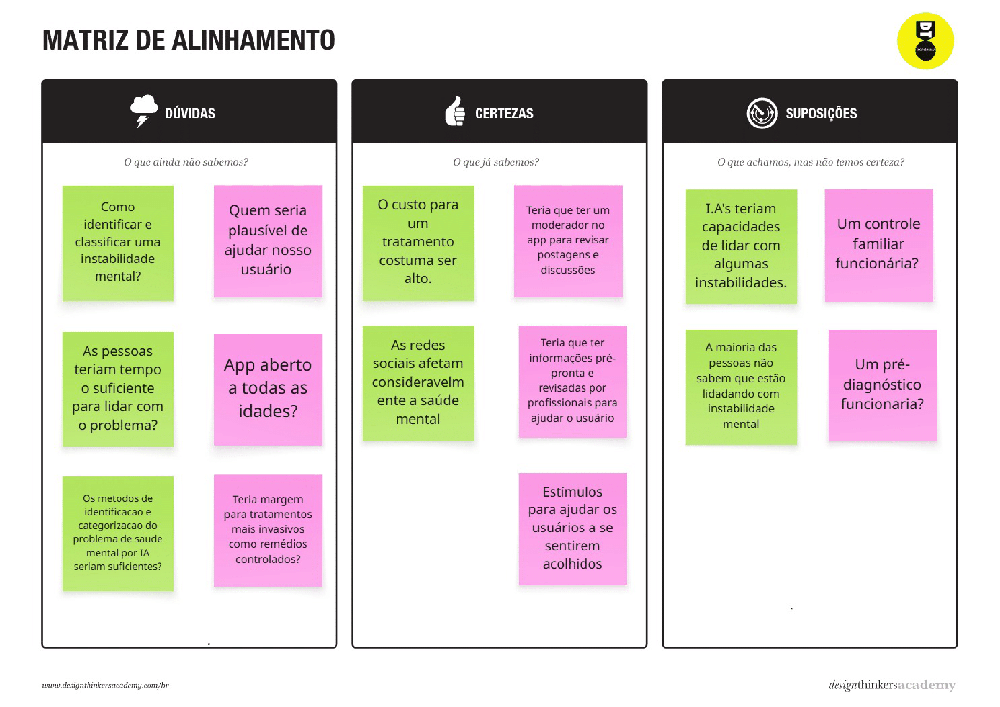
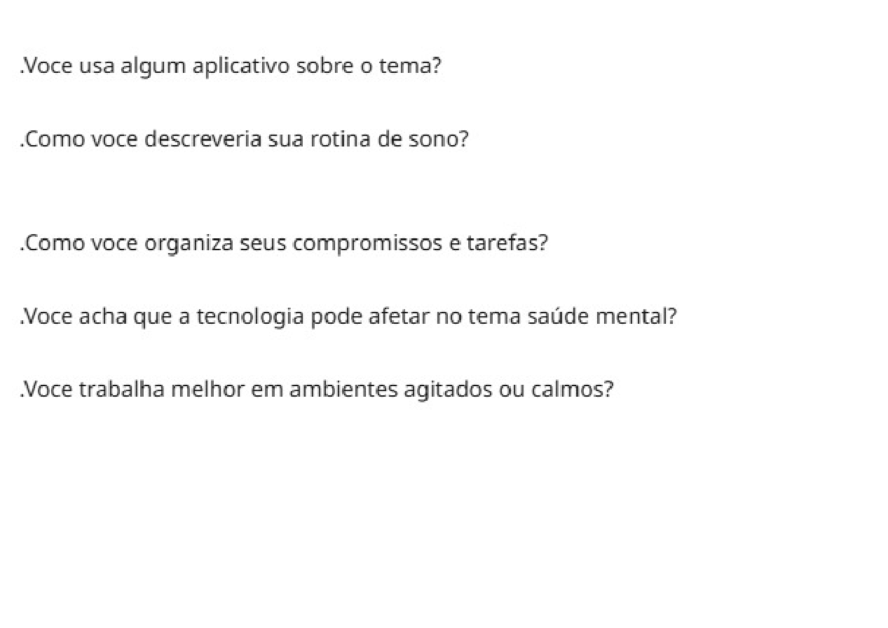
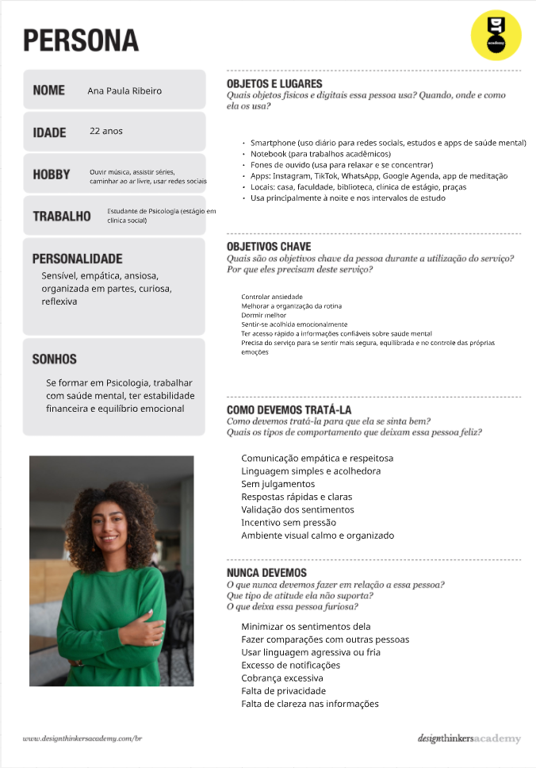
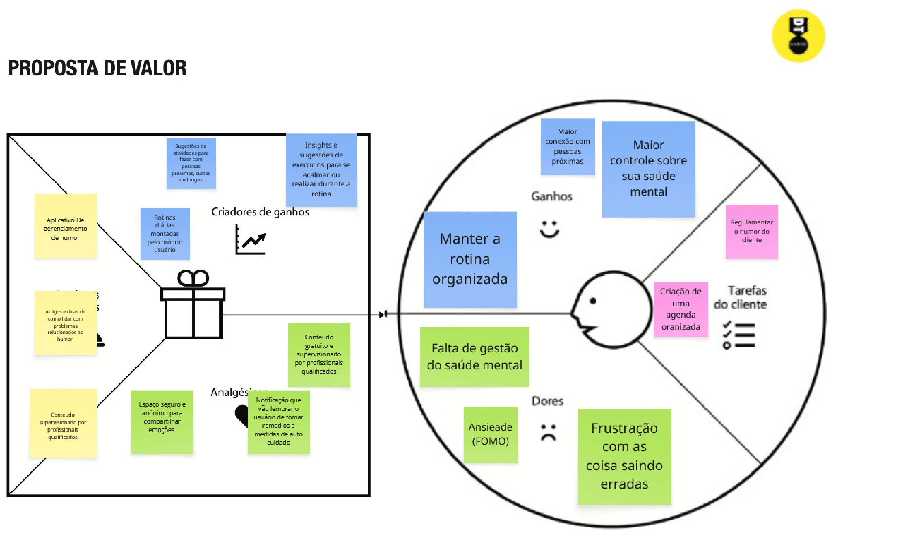
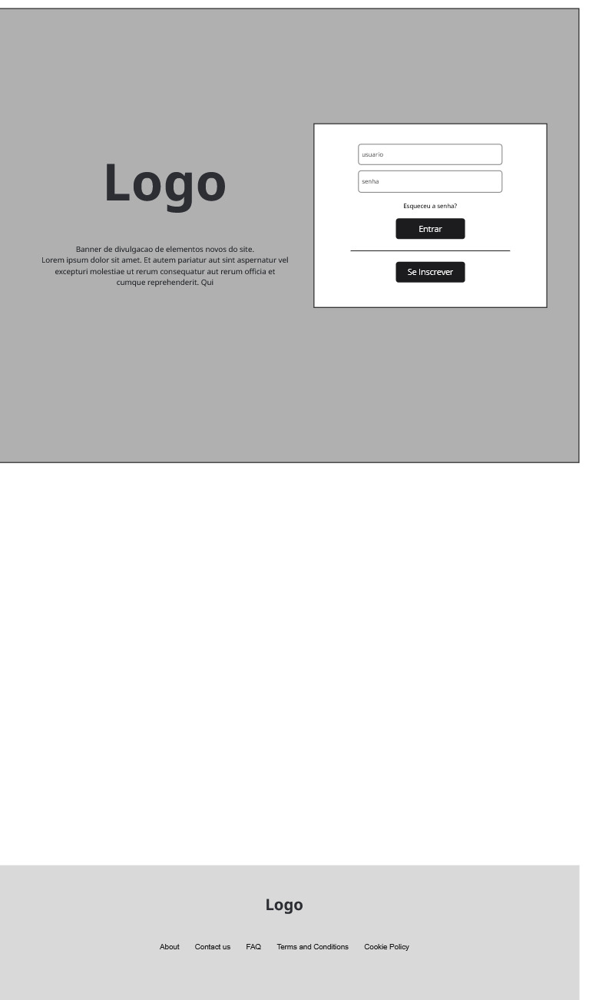
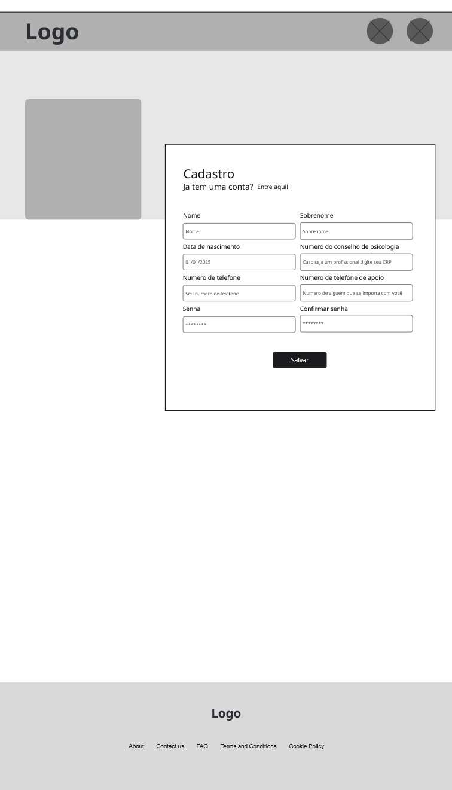
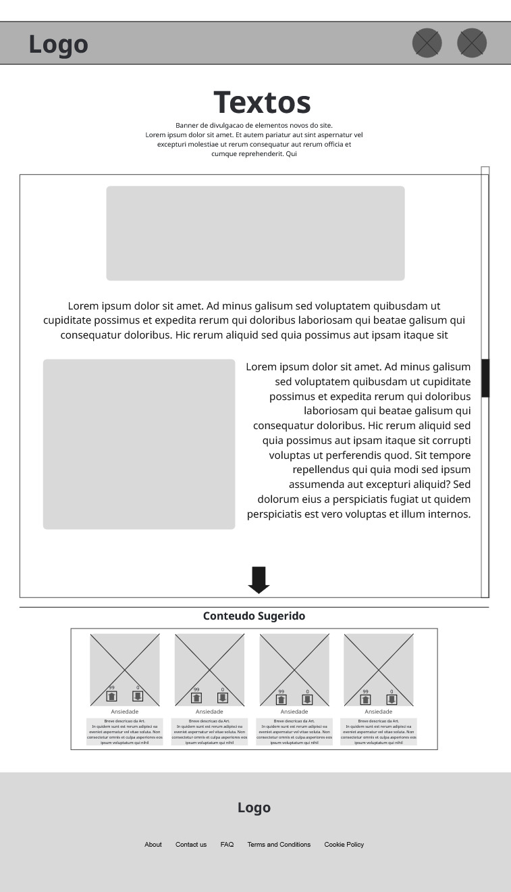
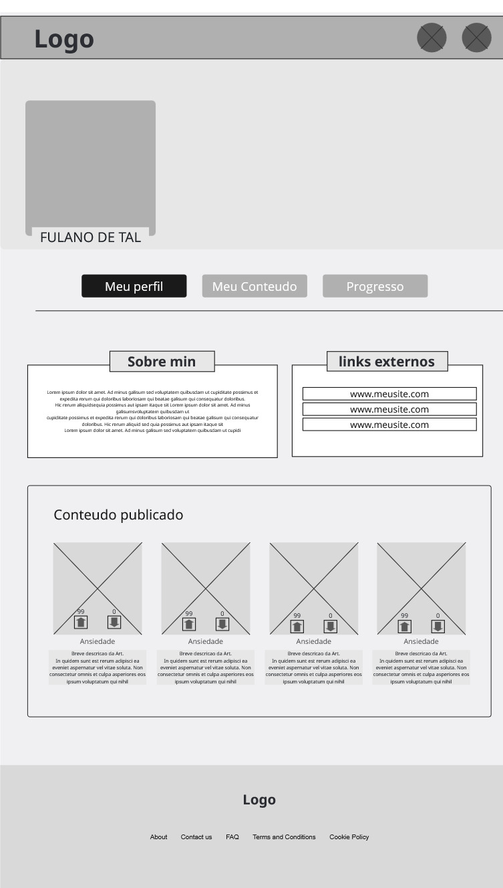
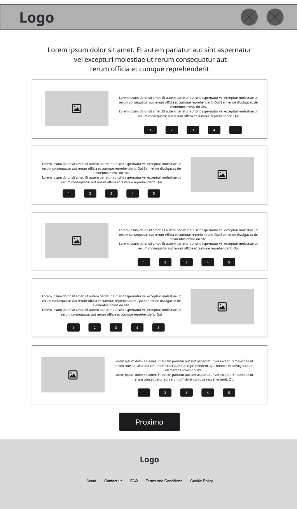
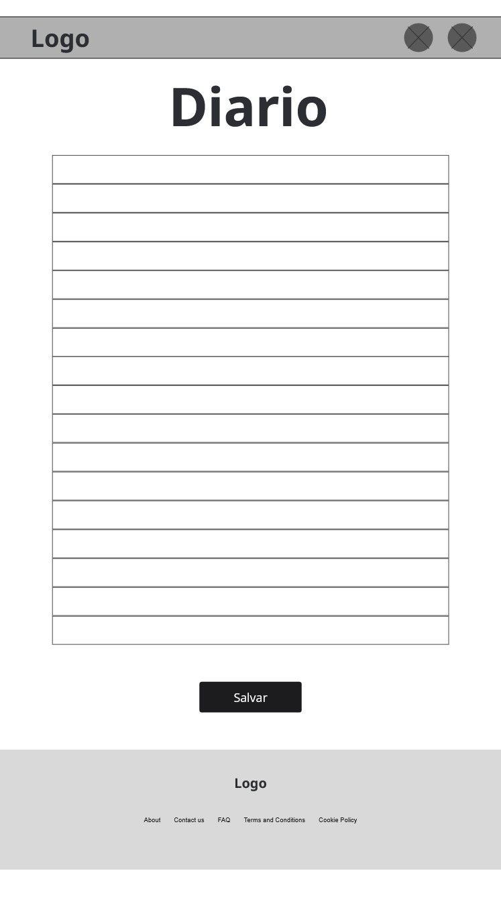

# Introdução

Informações básicas do projeto.

- **Projeto:** Amparo.me
- **Repositório GitHub:** [Link](https://github.com/ICEI-PUC-Minas-PPLES-TI/plf-es-2025-2-ti1-5567100-instabilidade-saude-mental/)
- **Membros da equipe:**

  - [Gabriel](https://github.com/gabrielkatahira)
  - [Sávio](https://github.com/saviopesso214-hue)
  - [Orlando](https://github.com/adramax)
  - [Cesar](https://github.com/Cesarlac)

A documentação do projeto é estruturada da seguinte forma:

1. Introdução
2. [Contexto](#contexto)
3. [Product Discovery](#product-discovery)
4. [Product Design](#product-design)
5. [Metodologia](#metodologia)
6. [Solução](#solução-implementada)
7. [Referências Bibliográficas](#referências)

✅ [Documentação de Design Thinking (MIRO)](files/processo-dt.pdf)

# Contexto

Detalhes sobre o espaço de problema, os objetivos do projeto, sua justificativa e público-alvo.

## Problema

O problema em questão se trata da falta de divulgação e conscientização em relação à saúde mental. Acreditamos que essa aplicação pode ser utilizada por qualquer um que esteja passando por transtornos mentais, independentemente da gravidade do problema.

## Objetivos

Visto o problema, acreditamos que através da criação de uma comunidade própria para uma divulgação de soluções e tratamento para transtornos mentais, talvez será possível reduzir seu impacto. A comunidade poderia contar com profissionais qualificados para melhor tratar estes problemas. Um dos objetivos finais é poder curar uma comunidade que ajuda a si própria. O outro objetivo seria oferecer este apoio personalizado para todos que forem utilizar a plataforma, independente de quem seja.

## Justificativa

Acreditamos que o tópico da saúde mental ainda não recebe atenção o suficiente do público no geral, apesar de ser algo que afeta a população como um todo, independente da idade. A ideia de ter uma comunidade que ajuda a si própria vem do fato de que nós como seres humanos somos inerentemente empáticos, e sempre terá outro que já passou pelo mesmo problema. Através de um espaço onde essa empatia pode ser estimulada, poderemos ser capazes de resolver diversos problemas.

## Público-Alvo

Apesar da saúde mental ser um problema que afeta a população inteira em geral, é importante determinar ainda, diferentes grupos que serão mais específicos para o aplicativo. Em um geral, haverão usuários que só lerão posts e não engajarão muito, mas é impossível ignorá-los, pois provavelmente constituirão a maioria. Há também usuários que sempre estarão dispostos a ajudar, sendo estes valiosos por engajarem na comunidade e incentivar outros a engajarem.

Quando se trata de especificidades, é importante ressaltar que nem todos os problemas da saúde mental podem ser categorizados. Ou seja, há também aqueles que não conhecem o problema que têm, e é importante que eles possam também ser guiados para descobrir a resposta.

# Product Discovery

## Etapa de Entendimento

**Matriz CSD**


**Mapa de Stakeholders**


**Entrevistas Qualitativas**


[Highlights de Pesquisa]()

## Etapa de Definição

### Personas




# Product Design

Nesse momento, vamos transformar os insights e validações obtidos em soluções tangíveis e utilizáveis. Essa fase envolve a definição de uma proposta de valor, detalhando a prioridade de cada ideia e a consequente criação de wireframes, mockups e protótipos de alta fidelidade, que detalham a interface e a experiência do usuário.

## Histórias de Usuários

Com base na análise das personas foram identificadas as seguintes histórias de usuários:

| ID   | EU COMO...`PERSONA`                                                            | QUERO/PRECISO ...`FUNCIONALIDADE`                                    | PARA ...`MOTIVO/VALOR`                            |
| ---- | ------------------------------------------------------------------------------ | -------------------------------------------------------------------- | ------------------------------------------------- |
| US01 | Pessoa em Crise de Pânico/Ansiedade                                            | Acessar uma seção emergência/crise                                   | Conseguir me acalmar rapidamente                  |
| US02 | Usuário que busca melhorar a saúde a longo prazo                               | Poder registrar meu humor diariamente                                | Refletir sobre e adotar hábitos mais saudáveis    |
| US03 | Pessoa que precisa de apoio profissional, mas tem receio/dificuldade de acesso | Pesquisar consultas com profissionais, com opções para filtros       | Encontrar profissionais de modo fácil e acessível |
| US04 | Usuário que se sente desorganizado no dia a dia                                | Criar e personalizar uma rotina de autocuidado                       | Estabelecer uma consistência no meu cotidiano     |
| US05 | Usuário que quer entender melhor sobre a saúde mental                          | Acessar uma biblioteca organizada com conteúdo detalhado e curado    | Me informar de modo confiável                     |
| US06 | Pessoa com dificuldade de expressar as emoções                                 | Responder perguntas guiadas diárias, preenchendo um diário reflexivo | Organizar meus pensamentos de forma estruturada   |

## Proposta de Valor



## Projeto de Interface

Artefatos relacionados com a interface e a interacão do usuário na proposta de solução.

### Wireframes

Estes são os protótipos de telas do sistema.

**Login**
Página inicial, que permite o usuário fazer login.


**Cadastro**
OPagina de cadastro


**Meu conteudo**
Página inicial dos posts, mostrando todos.


**Progresso diario**
Diário pessoal do usuário.


**Pagina do Diario**
Pagina onde mostra o diario.


**Pagina Humor**
Página que aparece quando se clica num post específico.


**Pagina Artigo**
Posts do usuário.


**Editar Perfil**
Alteração de dados do usuário.


**Meu perfil**
Perfil do usuario.


**perguntas sobre humor**
Perguntas sobre o humor diario do usuario.


**Pagina do diario**
Pagina que te permite escrever o diario.


**Pagina Inicial**
Pagina que exibe os conteudos.


**Pagina comunidade**
Pagina que exibe os conteudos por comunidade.


**Pagina Criacao de comunidade**


**Pagina Criacao de post**


### User Flow


### Protótipo Interativo

[MarvelApp](https://marvelapp.com/prototype/11cb1874)

# Metodologia

Detalhes sobre a organização do grupo e o ferramental empregado.

## Ferramentas

Relação de ferramentas empregadas pelo grupo durante o projeto.

| Ambiente                    | Plataforma | Link de acesso                                                                     |
| --------------------------- | ---------- | ---------------------------------------------------------------------------------- |
| Processo de Design Thinking | Miro       | https://miro.com/app/board/uXjVJOD1GsM=/?share_link_id=85832136044                 |
| Repositório de código       | GitHub     | https://github.com/ICEI-PUC-Minas-PPLES-TI/plf-es-2025-2-ti1-5567100-amparo-me.git |
| Hospedagem do site          | Render     | plf-es-2025-2-ti1-5567100-amparo-me-production.up.railway.app                      |
| Protótipo Interativo        | MarvelApp  | https://marvelapp.com/prototype/11cb1874                                           |
|                             |            |                                                                                    |

## Gerenciamento do Projeto

🧳 OBJETOS E LUGARES

Quais objetos físicos e digitais essa pessoa usa? Quando, onde e como ela os usa?
Smartphone (uso diário para redes sociais, estudos e apps de saúde mental)
Notebook (para trabalhos acadêmicos)
Fones de ouvido (usa para relaxar e se concentrar)
Apps: Instagram, TikTok, WhatsApp, Google Agenda, app de meditação
Locais: casa, faculdade, biblioteca, clínica de estágio, praças
Usa principalmente à noite e nos intervalos de estudo

🎯 OBJETIVOS CHAVE

Quais são os objetivos dessa pessoa durante a utilização do serviço? Por que eles precisam deste serviço?
Controlar ansiedade
Melhorar a organização da rotina
Dormir melhor
Sentir-se acolhida emocionalmente
Ter acesso rápido a informações confiáveis sobre saúde mental
Precisa do serviço para se sentir mais segura, equilibrada e no controle das próprias emoções

💛 COMO DEVEMOS TRATÁ-LA

Como devemos tratá-la para que ela se sinta bem? Quais comportamentos deixam essa pessoa feliz?
Comunicação empática e respeitosa
Linguagem simples e acolhedora
Sem julgamentos
Respostas rápidas e claras
Validação dos sentimentos
Incentivo sem pressão
Ambiente visual calmo e organizado

🚫 NUNCA DEVEMOS

O que nunca devemos fazer em relação a essa pessoa? O que ela não suporta? O que a deixa furiosa?
Minimizar os sentimentos dela
Fazer comparações com outras pessoas
Usar linguagem agressiva ou fria
Excesso de notificações
Cobrança excessiva
Falta de privacidade
Falta de clareza nas informações

Metodologia de Trabalho, Ferramentas e Organização do Projeto

O projeto foi desenvolvido de forma organizada e em equipe, utilizando o Design Thinking para compreender o problema, definir o público-alvo e criar a persona por meio de perguntas e do mapa de valores. Em seguida, foi elaborado o userflow para organizar o caminho do usuário dentro da aplicação.

A organização das tarefas foi feita por meio de um quadro Kanban, permitindo acompanhar o que estava para fazer, em desenvolvimento e finalizado. Para a parte visual e organização das ideias, foi utilizada a ferramenta Miro.

O desenvolvimento foi realizado no Visual Studio Code, com uso do GitHub para armazenar os arquivos e registrar as alterações, e do Json-server para simular o banco de dados. As tarefas foram divididas entre os integrantes de forma equilibrada, garantindo a participação de todos no projeto.

# Solução Implementada

Esta seção apresenta a solução desenvolvida ao longo do projeto.

O site criado é um hub de apoio pessoal, onde os usuários podem criar conteúdos, avaliar publicações e organizar os materiais por temas. A plataforma permite que as pessoas encontrem artigos com técnicas, ideias e textos que auxiliam no enfrentamento da ansiedade, depressão e outros desafios do dia a dia.

O sistema também conta com um espaço para diário pessoal, onde o usuário responde perguntas, registra seus sentimentos e pode acompanhar como esteve emocionalmente em dias anteriores. Com base nesses registros, a plataforma consegue indicar conteúdos mais adequados ao que o usuário está sentindo, priorizando materiais que ajudaram outras pessoas com problemas semelhantes.

Dessa forma, a solução promove o autoconhecimento, o acompanhamento emocional e o acesso direcionado a conteúdos de apoio.

## Vídeo do Projeto

[](https://youtu.be/Ps5rCYJiyYI?si=CGzxR6YeG2Ar8-md)

## Funcionalidades

Esta seção apresenta as funcionalidades da solução.Info

##### Funcionalidade 1 - Cadastro de Usuario

Permite a inclusão, leitura, alteração e exclusão de contatos para o sistema

- **Instruções de acesso:**
  - Abra o site e efetue o login
  - Caso nao tenha a conta, crie uma
  - Em seguida comfirme e seja redirecionado para a pagina inicial.
- **Tela da funcionalidade**:


- **Estrutura de dados:**

Contatos da aplicação

```json
   {
      "id": "f1a4",
      "nome": "teste",
      "username": "teste",
      "email": "asdsadsa@gmail",
      "telefone": "31",
      "senha": "123",
      "bio": "asdadsdadsada"
    },
```

##### Funcionalidade 2 - Criacao de Artigo

Permite criacao de textos, e artigos para
o feed ou comunidade.

- **Instruções de Criacao:**
  - Na pagina inicial, clique em criar post.
  - Adicione texto, imagem e links importantes
  - Em seguida comfirme e seja redirecionado para a pagina do post
- **Tela da funcionalidade**:


- **Estrutura de dados:**

Contatos da aplicação

```json
 {
      "comunidade": "1",
      "categoria": "Saude Mental",
      "tipo": "texto",
      "title": "testeAjustandoTitulo",
      "text": "As entregas são individuais e a avaliação será feita por pares e depois consolidada pelos professores da disciplina. Cada aluno avaliará o trabalho de 2 a 3 colegas de outros grupos. A distribuição dos trabalhos a serem avaliados será realizada pelos professores da disciplina no dia seguinte à data de entrega do trabalho.\n\nFinalizando a Entrega",
      "imageUrl": "https://www.psitto.com.br/wp-content/uploads/2024/12/depressao-como-sair-1.jpg",
      "link": "https://pucminas.instructure.com/courses/246513/files/14792797?wrap=1",
      "user_id": "8495",
      "createdAt": "2025-11-19T16:49:15.607Z",
      "id": "1ced"
    },
```

##### Funcionalidade 3 - Cadastro de Comunidades

Permite a inclusão, leitura, alteração e exclusão de comunidades

- **Instruções de acesso:**
  - Caso nao tenha nenhuma comunidade crie a sua
  - Em seguida comfirme e seja redirecionado para a comunidade.
- **Tela da funcionalidade**:


- **Estrutura de dados:**

Contatos da aplicação

```json
    {
      "name": "Ansiedade Social",
      "description": "Uma comunidade feita para discussão sobre a ansiedade social e relacionados",
      "imagem": "https://external-content.duckduckgo.com/iu/?u=https%3A%2F%2Fimages.pexels.com%2Fphotos%2F897817%2Fpexels-photo-897817.jpeg%3Fcs%3Dsrgb%26dl%3Dangustia-depressao-desespero-estressado-897817.jpg%26fm%3Djpg&f=1&nofb=1&ipt=a784a423004ed7b479c909d29081c0c69b2899f23304cdbc3ad557a09b4db379",
      "tags": [
        "ansiedade",
        "social"
      ],
      "id": "1"
    },
```

1. Cadastro de Usuário

Descrição:
Permite que novos usuários criem uma conta na plataforma para ter acesso às funcionalidades principais.

Estrutura de dados associada:
Usuário (id, nome, username, email, telefone, senha, bio)

Instruções de acesso e uso:
O usuário deve acessar a página de cadastro, preencher os dados solicitados e confirmar para criar sua conta. Após isso, poderá realizar o login no sistema.

2. Login do Usuário

Descrição:
Permite que o usuário acesse sua conta por meio do e-mail e senha.

Estrutura de dados associada:
Usuário (email, senha)

Instruções de acesso e uso:
O usuário deve informar seu e-mail e senha na tela de login para acessar a plataforma.

3. Criação de Artigos

Descrição:
Permite que o usuário crie textos, imagens e links para publicação em comunidades e no feed.

Estrutura de dados associada:
Artigo (id, título, texto, imagem, link, categoria, comunidade, data, usuário)

Instruções de acesso e uso:
Na página inicial, o usuário clica em “Criar post”, preenche os dados do artigo e confirma a publicação.

4. Cadastro de Comunidades

Descrição:
Permite que o usuário crie novas comunidades para discussão de temas específicos.

Estrutura de dados associada:
Comunidade (id, nome, descrição, imagem, tags)

Instruções de acesso e uso:
O usuário acessa a opção de criação de comunidade, preenche os campos e confirma o cadastro.

5. Diário Pessoal

Descrição:
Permite que o usuário registre seus sentimentos diariamente e acompanhe seu histórico emocional.

Estrutura de dados associada:
Diário (id, data, humor, texto, usuário)

Instruções de acesso e uso:
O usuário acessa a área do diário, responde às perguntas e salva o registro.

Funcionalidades para Administradores 6. Gerenciamento de Usuários

Descrição:
Permite ao administrador visualizar, editar ou remover usuários da plataforma.

Estrutura de dados associada:
Usuário

Instruções de acesso e uso:
O administrador acessa o painel administrativo e gerencia os usuários cadastrados.

7. Gerenciamento de Artigos

Descrição:
Permite ao administrador visualizar, editar ou remover artigos publicados.

Estrutura de dados associada:
Artigo

Instruções de acesso e uso:
O administrador acessa o painel de controle e realiza a moderação dos conteúdos.

8. Gerenciamento de Comunidades

Descrição:
Permite ao administrador editar ou excluir comunidades que violem as regras da plataforma.

Estrutura de dados associada:
Comunidade

Instruções de acesso e uso:
O administrador acessa o painel administrativo e gerencia as comunidades criadas.

Módulos e APIs Utilizados

O projeto foi desenvolvido utilizando apenas tecnologias nativas da web, sem o uso de bibliotecas ou frameworks frontend externos. As principais tecnologias utilizadas foram HTML, CSS e JavaScript, responsáveis pela estrutura das páginas, estilização da interface e implementação das funcionalidades da aplicação.

O editor de código utilizado foi o Visual Studio Code, que auxiliou no desenvolvimento, organização dos arquivos e testes da aplicação.

Como principal ferramenta externa, foi utilizado o json-server, que funciona como uma API simulada, permitindo realizar operações de criação, leitura, atualização e exclusão de dados (CRUD). Essa API foi responsável pelo armazenamento e acesso às informações de usuários, artigos, comunidades e registros do diário.

Para o controle de versões e organização do código-fonte, foi utilizado o GitHub, possibilitando o acompanhamento da evolução do projeto por meio dos commits realizados.

Esses módulos e ferramentas foram suficientes para garantir o funcionamento completo da solução desenvolvida.

> **Orientações**:
>
> - [Formato ABNT](https://www.normastecnicas.com/abnt/trabalhos-academicos/referencias/)
> - [Referências Bibliográficas da ABNT](https://comunidade.rockcontent.com/referencia-bibliografica-abnt/)
